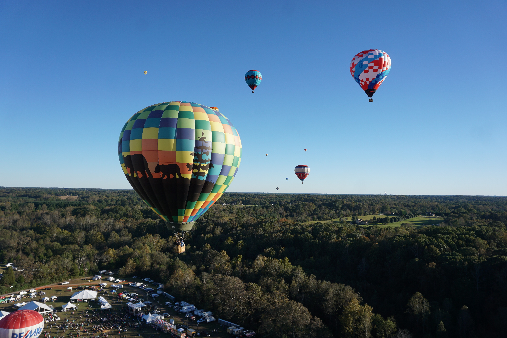

Casey Mahler
=========
Boone, NC 28607

Here is a link to my personal [webpage](https://mahlertn.wixsite.com/caseymahler/about)

### Education
##### Appalachian State University- *May 2022*

**Bachelor of Science**: Geography with Geospatial Information Systems Certificate

**Minor**: Urban Planning

### Summary

My past experiences have attributed to my desire to contribute to community development, resource conservation, and environmental justice.

### Skills

- Storytelling
- Self-Management
- Research and Analysis

